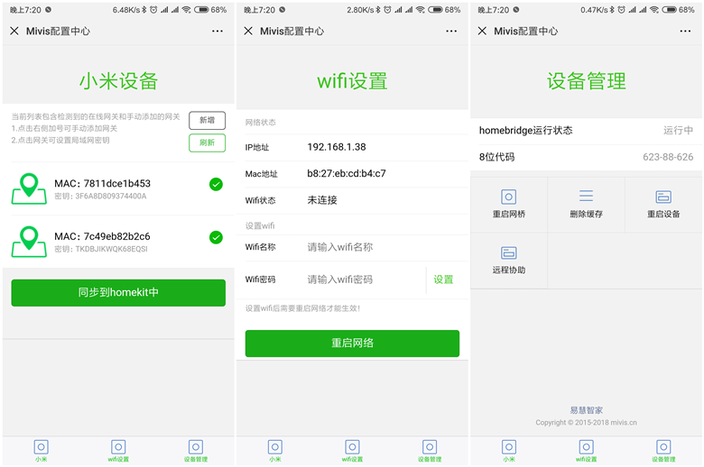
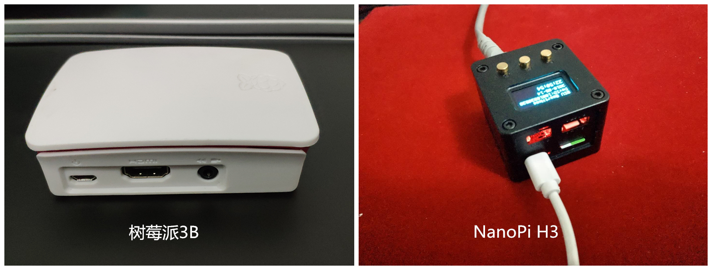
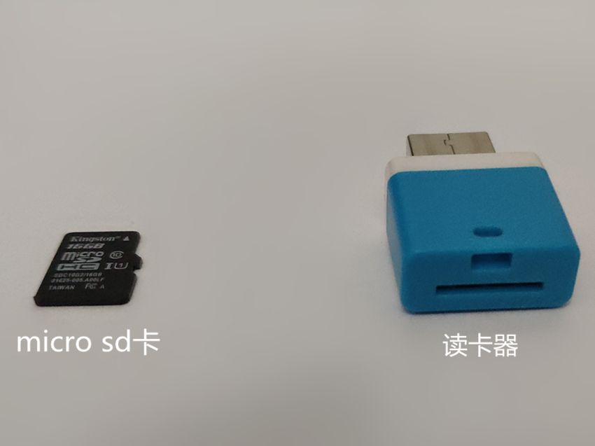
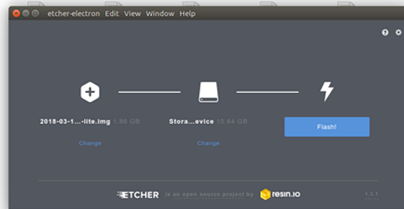

# 1.mivis
mivis项目的目的是为了更快，更便捷的使用将小米网关，博联相关设备加入到homekit中



# 2.所需硬件

* 树莓派主板或者NanoPi H3，及电源
* micro-sd卡，class10 16G即可
* 读卡器




# 3.所需软件

* windows系统需要下载putty软件，用来连接到主机，https://www.putty.org/
* etcher软件,用来将系统刻录到sd卡中，下载地址 https://etcher.io/ 
* 树莓派需要下载raspbian镜像 下载地址 https://www.raspberrypi.org/downloads/raspbian/ 选择RASPBIAN STRETCH LITE下载，大小365.8M
* NanoPi H3需要下载Nanopi系统 下载地址: https://pan.baidu.com/s/1ZZIqhZAgaJxAZtwyd2v13w


# 4.烧录系统

1. 将sd卡插入读卡器，插入电脑usb口
2. 打开etcher，选择下载的镜像，选择u盘，点击flash开始烧录
3. 烧录完成后，需要在boot盘创建ssh文件，内容为空即可，这是为了开启ssh功能

>耗时约5-6分钟

# 5.安装软件

1. 将sd卡插入树莓派或NanoPi，插入网线，启动系统
2. 获取设备IP，在路由器中查看即可
3. window系统打开putty，连接系统，输入ip，端口为22;
4. Linux和Mac系统打开终端，输入命令`ssh pi@192.168.x.y`,树莓派的默认用户名为pi，密码为raspberry；NanoPi的默认用户名为root，密码为fa
4. 连接到主机后，`树莓派`执行如下命令

```
cd ~ && wget -N http://web.uxiaowo.com/mivis/install_mivis && chmod 777 install_mivis && ./install_mivis
```

`Nanopi`执行如下命令：

```
cd ~ && wget -N http://web.uxiaowo.com/mivis/install_mivis_h3 && chmod 777 install_mivis_h3 && ./install_mivis_h3
```
最后重启即可。


# 6.配置系统


1. 浏览器打开http://IP:9981，按照网页设置网关密钥，选择需要添加的网关，同步到homekit即可，最后需要重启homekit
2. 配置wifi，树莓派B3自带wifi组件，H3需要在usb口插入无线wifi，根据页面提示，选择适合的wifi即可。最后需要重启网络。
